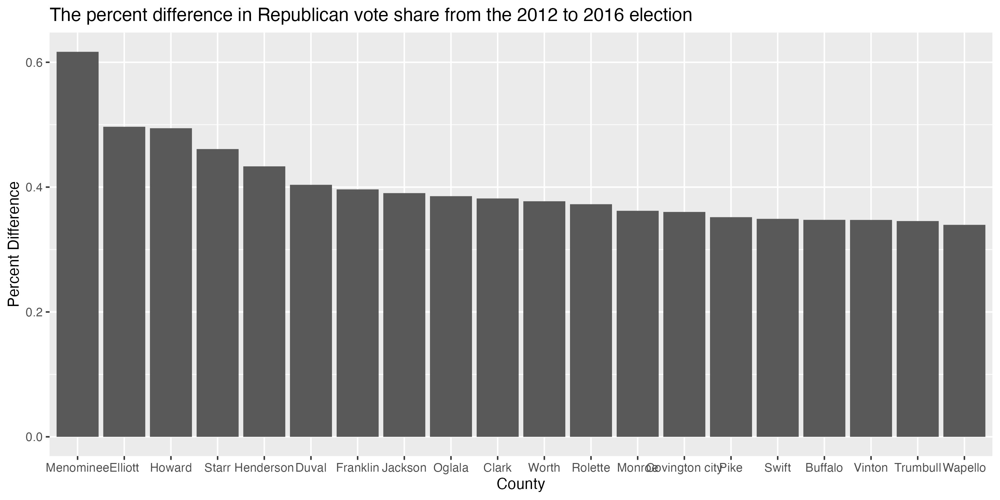

## Visualization Example

Blah blah

```{r, message=FALSE}
library(tidyverse)
# Don't forget to specify the exact file directory where your data is saved at!
elec <- read_csv("uselection.csv") 

elec <- elec |>
  mutate(gop_vs_12 = votes_gop_12/votes_total_12,
         gop_vs_16 = votes_gop_16/votes_total_16) |>
  mutate(gop_vs_diff = (gop_vs_16 - gop_vs_12)/gop_vs_12)

fig <- elec |>
  slice_max(gop_vs_diff, n = 20) |>
  ggplot(aes(x = fct_reorder(county, desc(gop_vs_diff)), y = gop_vs_diff)) +
  geom_bar(stat = "identity") +
  labs(title = "The percent difference in Republican vote share from the 2012 to 2016 election", 
       x = "County", y = "Percent Difference")

ggsave("barplot.png", fig, width = 10, height = 5)
```


